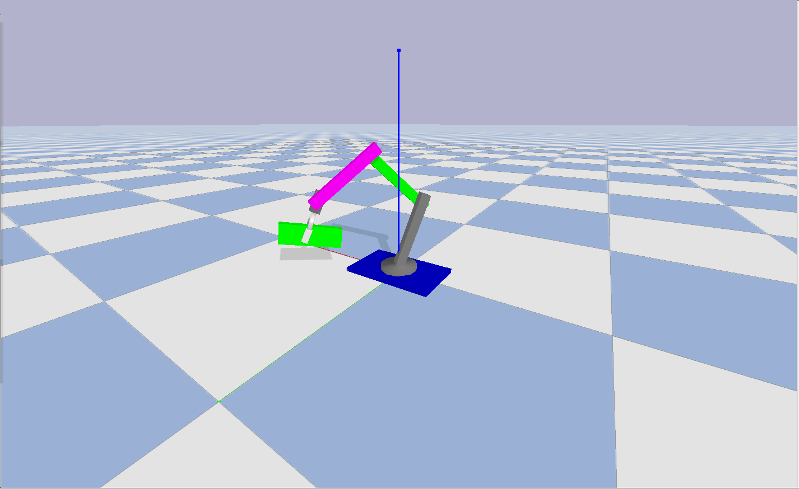
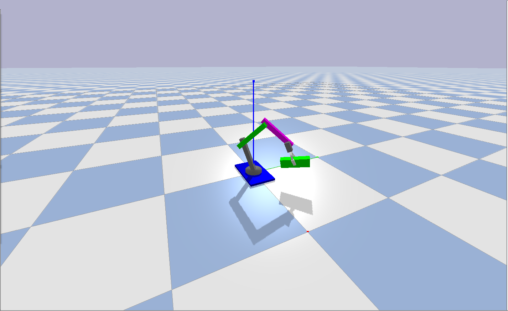

# ROS2 Gripper Robotic Arm Simulation

This repository contains a **ROS2-controlled gripper robotic arm** fully simulated using **PyBullet**. You can control the arm in real-time with a joystick to **pick up, carry, and manipulate objects** within a realistic physics environment.

---

## Features

- Fully simulated robotic arm with **gripper control**.
- Realistic **physics simulation** using **PyBullet**.
- Control via **ROS2 joystick input**.
- Pick up, carry, and manipulate objects in the simulation.
- Customizable URDF for easy modifications.
- Real-time sensor feedback and control via ROS2 topics.

---

## Demo






> The gripper can pick up objects and move them around the PyBullet simulation environment.

---

## Installation

1. Clone the repository:

```bash
git clone https://github.com/your-username/ros2-gripper-arm.git
cd ros2-gripper-arm
